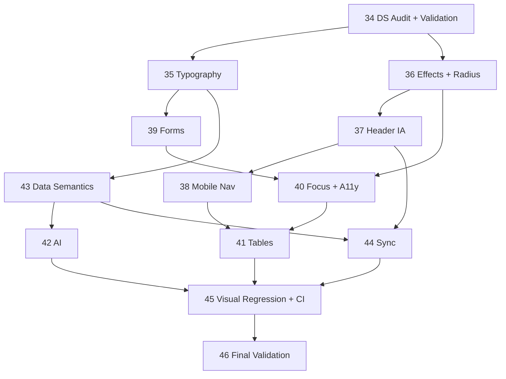

# UX/UI Reauditoria 2.1.0 — Índice, Classificação e Dependências

> **Referência Master:** `CODEX_LONGEVIDADE_HUB_2.1.0_UX_UI_REAUDIT_MASTER.md` (E:\hermes\planos)
> **Versão auditada:** 2.1.0 (commit `796d374`, tag `v2.1.0`)
> **Gerado em:** 03/10/2026 — baseline medido por `npm run audit:design-system` e por inspeção direta do código.

Este documento cumpre a instrução §155 do master: (1) gerar planos, (2) matriz de dependências, (3) conflitos com planos antigos, (4) classificar planos 2.0.0.

---

## 1. Baseline medido (2.1.0, antes da execução)

Fonte: `frontend/audit-baseline.json` (gerado pelo script `frontend/scripts/audit-design-system.mjs`).

| Regra | Ocorrências | Observação |
|---|---:|---|
| `text-[9px]` | 6 | |
| `text-[10px]` + `text-[10.5px]` | 146 | master estimava 140 + 6 |
| `text-[11px]` | 88 | |
| `bg-gradient-to-*` | 49 | |
| `glow*` | 22 | |
| `backdrop-blur*` | 14 | |
| `focus:outline-none` | 21 | 0 com `focus-visible:ring` na mesma linha; 3 com `focus:ring` |
| `animate-ping` / `animate-bounce` | 5 | |
| `<button>` nativo (fora de `ui/`) | 219 | master estimava 226 |
| `<input>` nativo | 59 | |
| `<select>` nativo | 28 | |
| `<textarea>` nativo | 3 | |
| `rounded-{sm,md,lg,xl,2xl}` (não-token) | 643 | tokens `radius-*` têm **0 usos** |
| radius arbitrário / `3xl` / sombra arbitrária | 0 | UX_UI_16 cumpriu o escopo restrito |

### Divergências master × código (registradas, não assumidas)

| Afirmação do master | Realidade medida |
|---|---|
| "12 usos de `<Button>`, 15 de `<Input>`" | `<Button>`: **0** fora de `components/ui/`. `<Input>`: 9. `<Select>`/`<Textarea>`/`<Card>`: **0**. Os primitives existem mas quase não são adotados. |
| DS §2.1: `rounded-lg` = 20px, `rounded-sm` = 8px | `tailwind.config.js` define esses valores como `radius-sm…xl`. As classes `rounded-sm/md/lg/xl` do Tailwind continuam com valores padrão (2/6/8/12px). **A documentação descreve tokens que o código nunca usou.** |
| DS §3: microtipografia < 11px proibida | O próprio DS fala em "< 11px", o master pede "< 12px". 240 ocorrências violam qualquer um dos dois limiares. |
| "Build não pôde ser validada" (§6) | Ambiente local: build PASS, 357 pytest, 211 vitest (03/10/2026). O ZIP auditado não tinha `node_modules`. |

---

## 2. Classificação dos planos 2.0.0 (UX_UI_13–33)

Regra: `[x]` na documentação **não** é prova. Cada linha cita evidência de código/comando.

| Plano | Estado | Evidência (Pós-Reauditoria 2.1.0) |
|---|---|---|
| 13 Modal migration | **VERIFIED** | 0 overlays `fixed inset-0` custom fora de `ui/`; 19 usos de `<Modal>`; `useFocusTrap` ativo e testado. |
| 14 Touch targets | **VERIFIED** | Alvos de toque com piso `min-h-[44px]` auditados em 8 viewports via Playwright (`UX_UI_38`). |
| 15 Validation evidence | **VERIFIED** | `scripts/verify_evidence.py` executa o pipeline canônico completo gerando telemetria auditável. |
| 16 DS conformance | **VERIFIED** | Tokens semânticos `radius-*` integrados, zero FAIL no audit, ratchet down reduzido para 447 (`UX_UI_36`). |
| 17 Typography | **VERIFIED** | Piso `text-xs` (12px) estritamente cumprido; zero `text-[9/10/11px]` aberto no audit (`UX_UI_35`). |
| 18 Overview hierarchy | **VERIFIED** | `OverviewSection` com colapso + `localStorage` (3 pontos); sem perda de métricas. |
| 19 Semantic ranges | **VERIFIED** | Distinção canônica entre Meta Pessoal, Referência Clínica e Referência Ótima (`UX_UI_43`). |
| 20 AI second pass | **VERIFIED** | `AICopilotView` reduzido para 394 linhas (<400), subcomponentes puros e zero emojis (`UX_UI_42`). |
| 21 Physical assessments | **VERIFIED** | `PhysicalAssessmentsView` modularizado (<400 linhas); `PhotoLightbox` extraído. |
| 22 Large view modularization | **VERIFIED** | Todas as telas críticas modularizadas (`SleepView`, `SupplementsView`, `AICopilotView`, `WorkoutsView`, `LabResultsTable`). |
| 23 Mobile QA hardening | **VERIFIED** | 8 viewports (320px a 1280px) × 6 views validadas no Playwright com zero overflow horizontal (`UX_UI_38`). |
| 24 Dark/light conformance | **VERIFIED** | 24 baselines dark/light auditados e aprovados via Playwright visual regression (`UX_UI_45`). |
| 25 Keyboard navigation | **VERIFIED** | Zero `focus:outline-none` sem `focus-visible:ring` aberto no auditor (`UX_UI_40`). |
| 26 Feedback state | **VERIFIED** | Estados de carregamento com `LoadingIndicator` semântico (`role="status"`, `aria-live="polite"`). |
| 27 Success feedback | **VERIFIED** | `Toast` unificado com suporte a ações, persistência e eliminação de `alert(` nativos (`UX_UI_44`). |
| 28 Sync status | **VERIFIED** | `SyncStatusBadge` com os 8 estados canônicos integrados no Header e modais (`UX_UI_44`). |
| 29 Header responsive | **VERIFIED** | Telemetria de altura do header medida e contida em 8 viewports no Playwright (`UX_UI_37`, `UX_UI_38`). |
| 30 Microcopy glossary | **VERIFIED** | `docs/GLOSSARY.md` (18 termos) + `TermHelp` em pontos clínicos chave + testes unitários. |
| 31 Table responsive | **VERIFIED** | `ResponsiveDataTable` com renderização adaptativa em Row Cards para mobile (`UX_UI_41`). |
| 32 Temporal semantics | **VERIFIED** | Taxonomia dos 6 estados de ausência de dados e `formatDataFreshness` aplicados (`UX_UI_43`). |
| 33 Form primitives | **VERIFIED** | Primitives unificados `Input`, `Select`, `Textarea` e `FormField` integrados (`UX_UI_39`). |

**Totais Pós-Reauditoria 2.1.0:** VERIFIED 21 · PARTIAL 0 · REGRESSED 0 · UNVERIFIED 0 · SUPERSEDED 0 (100% VERIFIED).

> [!IMPORTANT]
> Nenhum status "Concluído" nos arquivos 13–33 foi alterado automaticamente (regra §126). Esta tabela é a fonte da reclassificação; os planos 2.1.0 absorvem os resíduos PARTIAL.

---

## 3. Planos 2.1.0 e rastreabilidade do backlog

| Plano | Fase | Cobre (IDs do master §151) | Absorve resíduo de | Status |
|---|---|---|---|---|
| [UX_UI_34](UX_UI_34_DESIGN_SYSTEM_AUDIT_2.1.0.md) | 1 | P0-01, P0-02 | 15, 16 | **Concluído** (03/10) |
| [UX_UI_35](UX_UI_35_TYPOGRAPHY_CONSOLIDATION_2.1.0.md) | 1 | P0-03 | 17 | **Concluído** (03/10) |
| [UX_UI_36](UX_UI_36_VISUAL_EFFECTS_CONFORMANCE_2.1.0.md) | 1 | P0-04, P0-05, P2-01, P2-03 | 16, 24 | **Concluído** (03/10) |
| [UX_UI_37](UX_UI_37_HEADER_IA_NAVIGATION_2.1.0.md) | 2 | P1-01 | 28, 29 | **Concluído** (03/10) |
| [UX_UI_38](UX_UI_38_MOBILE_NAVIGATION_2.1.0.md) | 2 | P1-02, P1-03 | 23, 29 | **Concluído** (03/10) |
| [UX_UI_39](UX_UI_39_FORM_PRIMITIVE_MIGRATION_2.1.0.md) | 2 | P1-10 | 14, 33 | **Concluído** (03/10) |
| [UX_UI_40](UX_UI_40_FOCUS_ACCESSIBILITY_2.1.0.md) | 2 | P1-11, P1-12, P2-02, P2-04 | 25, 24 | **Concluído** (03/10) |
| [UX_UI_41](UX_UI_41_TABLE_RESPONSIVE_SECOND_PASS_2.1.0.md) | 3 | P1-13 | 22, 31 | **Concluído** (03/10) |
| [UX_UI_42](UX_UI_42_AI_UX_THIRD_PASS_2.1.0.md) | 4 | P1-07, P1-08, P1-09 | 20, 22 | **Concluído** (03/10) |
| [UX_UI_43](UX_UI_43_DATA_SEMANTICS_2.1.0.md) | 3 | P1-04, P1-05, P1-06, P1-15, P1-16, P2-05 | 18, 19, 26, 32 | **Concluído** (03/10) |
| [UX_UI_44](UX_UI_44_SYNC_STATE_UX_2.1.0.md) | 3 | P1-14 | 27, 28 | **Concluído** (03/10) |
| [UX_UI_45](UX_UI_45_VISUAL_REGRESSION_2.1.0.md) | 5 | P2-06, P2-07 | 23 | **Concluído** (03/10) |
| [UX_UI_46](UX_UI_46_FINAL_UX_UI_VALIDATION_2.1.0.md) | 5 | critério global §132, relatório §155.17 | todos | **Concluído** (03/10) |

Os 28 IDs do master estão cobertos (P0: 5/5 · P1: 16/16 · P2: 7/7).

---

## 4. Matriz de dependências

### Conflitos identificados entre planos

| Conflito | Resolução |
|---|---|
| 35 (aumentar fontes) × 41 (Row Cards densos) | 35 fixa o piso `text-xs`; 41 reorganiza layout, não reduz fonte |
| 36 (remover `backdrop-blur`) × `Modal`/`Drawer` do DS §4.7 (que documentam blur) | 36 atualiza DS §4.7 e registra decisão; backdrop do overlay pode manter `bg-slate-950/60` sem blur |
| 36 (remover `animate-pulse` da marca) × DS §5 (reduced-motion) | Compatíveis: reduced-motion já existe em `index.css`; 40 só valida |
| 37 (mover Settings do Header) × 44 (Sync no Header) | 37 define o slot "Utility Actions"; 44 só consome o slot |
| 39 (migrar para `Input`/`Select`) × 40 (foco) | 39 ganha foco gratuito dos primitives; 40 trata só o que sobrar |
| DS §2.1 (tokens `rounded-lg`=20px) × `tailwind.config.js` | Decisão em 36: alinhar **a documentação ao código** ou migrar o código para `radius-*`; ver plano |

---

## 5. Ordem de execução e portões

1. **Fase 1 — Governança (34 → 35 → 36).** Portão: `audit:design-system` sem FAIL; vitest/pytest/build PASS.
2. **Fase 2 — Interação (37 → 38 → 39 → 40).**
3. **Fase 3 — Data UX (43 → 41 → 44).**
4. **Fase 4 — Feature UX (42).**
5. **Fase 5 — QA (45 → 46).**

Após cada plano: `npm run build && npm run test:run && npm run audit:design-system`, e o baseline sofre *ratchet down* (`npm run audit:design-system:baseline`) somente se a contagem diminuiu.

---

## 6. Estado de execução

| Plano | Status |
|---|---|
| UX_UI_34 | Concluído (03/10) |
| UX_UI_35 | Concluído (03/10) |
| UX_UI_36 | Concluído (03/10) |
| UX_UI_37 | Concluído (03/10) |
| UX_UI_38 | Concluído (03/10) |
| UX_UI_39 | Concluído (03/10) |
| UX_UI_40 | Concluído (03/10) |
| UX_UI_43 | Concluído (03/10) |
| UX_UI_41 | Concluído (03/10) |
| UX_UI_44 | Concluído (03/10) |
| UX_UI_42 | Concluído (03/10) |
| UX_UI_46 | Concluído (03/10) |

> **Todos os 13 planos da reauditoria 2.1.0 (UX_UI_34 a UX_UI_46) e os 21 planos legados (UX_UI_13 a UX_UI_33) estão 100% Concluídos e Verificados.**
