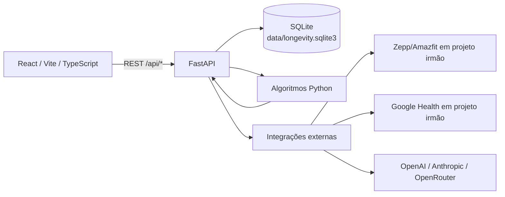
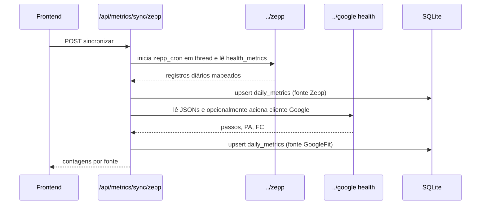

# Arquitetura e fluxos do Longevidade Hub

## 1. Escopo e camadas

O Longevidade Hub é uma aplicação web **local** de saúde e longevidade. O frontend React consulta uma API FastAPI, que concentra as regras de domínio e persiste os dados em SQLite.



| Camada | Diretórios/arquivos | Responsabilidade |
|---|---|---|
| UI | `frontend/src/` | Navegação, componentes, gráficos, modais e chamadas `fetch`. |
| Servidor HTTP | `backend/app/main.py` | Criação da aplicação, CORS, routers e serviço do frontend compilado. |
| Routers | `backend/app/routers/` | Validação Pydantic e endpoints REST. |
| Persistência | `src/longevidade/db/` | Criação do esquema SQLite e classe `LongevityRepository`. |
| Domínio | `src/longevidade/algorithms/`, `calculators/`, `reports/` | Cálculos de CGM, PhenoAge, N-of-1, KDM, razões cardiovasculares e Doctor Briefing. |
| Ingestão | `src/longevidade/ingestion/` | Mapeamento de snapshots Zepp e arquivos JSON do Google. |
| Avaliações Físicas | `src/longevidade/assessments/` | Serviço de armazenamento de imagens corporais, sanitização EXIF, hash SHA-256 e DTO de comparação. |
| Temas & Aparência | `frontend/src/context/ThemeContext.tsx` | Gerenciamento de tema visual (`dark` / `light`), persistência em `localStorage` (`longevity-hub-theme`) e anti-flash. |
| IA | `src/longevidade/ai/` | Composição de contexto clínico, prompts e clientes HTTP multi-provedor. |

## 2. Inicialização e execução

1. `run_app.bat` entra na raiz e ativa ou cria `.venv`.
2. Se `frontend/node_modules` não existir, executa `npm ci` em `frontend/`.
3. Se `frontend/dist` não existir, executa `npm run build` em `frontend/`.
4. O script inicia `uvicorn backend.app.main:app --host 127.0.0.1 --port 8011 --reload`.
5. Ao importar `backend.app.main`, `initialize_db(DB_PATH)` cria tabelas, aplica a migração defensiva de `category` e cria registros padrão quando necessários.
6. Se `frontend/dist` existir, `main.py` monta-o em `/`; caso contrário, o frontend deve rodar pelo Vite (`http://127.0.0.1:3000`).

A aplicação integrada fica em **http://127.0.0.1:8011**. Em desenvolvimento, o Vite fica em **http://127.0.0.1:3000** e encaminha `/api` ao backend.

## 3. Fluxos principais

### 3.1 Métricas de wearable



- `zepp_importer.py` percorre até 30 dias e prioriza snapshots retornados por `build_zepp_daily_record`.
- `google_importer.py` lê `google_steps.json`, `google_blood_pressure.json` e `google_heart.json` quando presentes.
- Cada fonte sobrescreve apenas os campos enviados no `UPSERT` de `daily_metrics`; o último importador pode alterar `source` para `GoogleFit`.
- As integrações são dependências de projetos irmãos, não código versionado deste repositório.

### 3.2 Exames e PhenoAge

1. A tela **Exames & PhenoAge** envia registros para `POST /api/labs/batch`.
2. `ingest_lab_records` normaliza a chave, aplica metadados de `OPTIMAL_LONGEVITY_TARGETS` e persiste em `lab_results`.
3. Ao fim do lote, monta os nove parâmetros de PhenoAge; valores ausentes recebem defaults definidos no código.
4. `calculate_phenoage` converte unidades, calcula `delta_xb`, PhenoAge, delta e uma estimativa de risco de 10 anos; o resultado é salvo em `phenoage_records`.
5. O dashboard lê o histórico com `GET /api/phenoage/history`.

### 3.3 CGM

O backend aceita leituras diretas por lote ou um CSV de FreeStyle Libre/Dexcom. No upload, detecta `;` ou `,`, tenta extrair data e valores entre 40 e 400 mg/dL e só salva dias com pelo menos três leituras. Para cada dia calcula média, desvio-padrão amostral, CV%, tempo em 70–140, acima de 140 e abaixo de 70 mg/dL.

### 3.4 Suplementos, hormônios e conformidade

- `supplement_stack` armazena a pilha ativa.
- `supplement_logs` registra a tomada diária por composto/data.
- Inclusão, alteração de dose/horário e remoção geram registros em `supplement_audit_logs`.
- `protocol_compliance` armazena quatro pilares (sono, suplementos, exercício e jejum). O score é a quantidade de pilares positivos × 25.
- A aba **Suplementos & Hormônios** permite filtrar, buscar, editar e consultar a linha do tempo de auditoria.

### 3.5 Copiloto de IA

```mermaid
flowchart TD
    A[UI: chat ou análise] --> B[/api/ai/*]
    B --> C[build_patient_clinical_context]
    C --> D[(SQLite)]
    C --> E[KDM e razões cardiovasculares]
    B --> F[provider_factory]
    F --> G[OpenAI]
    F --> H[Anthropic]
    F --> I[OpenRouter]
    G --> J[Resposta]
    H --> J
    I --> J
    J --> K[ai_insights_history]
    K --> D
```

O contexto inclui perfil, métricas recentes, exames, PhenoAge, CGM, N-of-1, pilha ativa, auditoria e aderência. A rota de insights tenta interpretar JSON e usa texto livre como fallback. Chat e análises são salvos em `ai_insights_history`.

## 4. Interface e navegação

`App.tsx` controla seis abas por estado local (`activeTab`); não existe React Router nem rotas/deep links por URL:

| Aba | Componente/tela | Fonte principal |
|---|---|---|
| Visão Geral | `App.tsx`, `DateNavigator`, `DailyComplianceWidget`, `CGMDashboard`, `PhenoAgeWidget` | métricas, PhenoAge, CGM e compliance |
| Exames & PhenoAge | `LabResultsTable` | exames e lote de marcadores |
| Suplementos & Hormônios | `SupplementsView` | pilha, logs diários, auditoria e IA |
| IA & Copiloto | `AICopilotView`, `AISettingsModal` | configurações, histórico, chat e insights |
| N-of-1 Tests | `NOf1Tracker` | experimentos persistidos |
| Perfil | `ProfileView` | perfil, IMC e indicadores Google |

O tema usa Tailwind, paleta escura (`#0B0F17`) e componentes `lucide-react`; os gráficos usam Recharts.

## 5. Versionamento

A versão do sistema é **unificada** em **0.6.0**:

- Fonte de verdade: `src/longevidade/version.py` (`__version__`)
- Pacote Python: lê de `version.py` via `__init__.py`
- Frontend: `frontend/package.json`
- FastAPI: usa o `__version__` importado do pacote
- `/api/health` retorna a versão unificada no campo `version`

Todas as modificações de versão devem ser feitas em `src/longevidade/version.py`.
