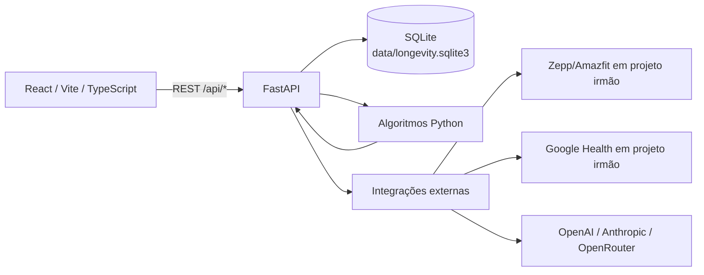
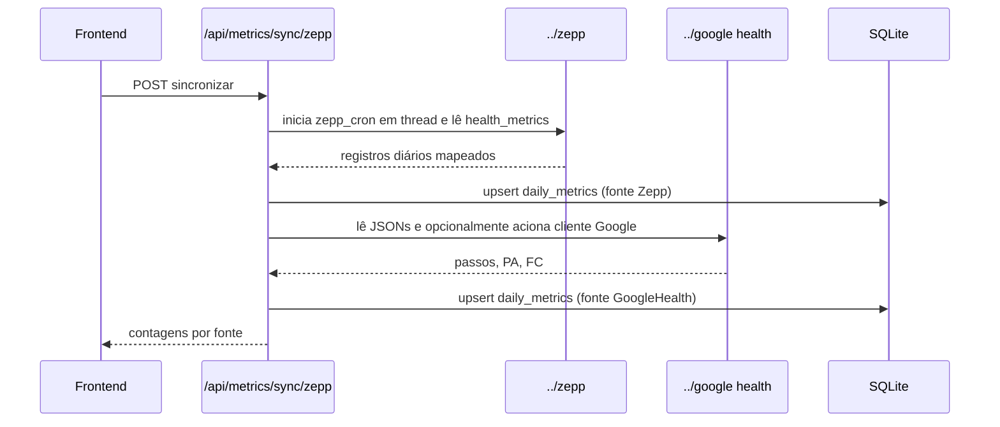

# Arquitetura e fluxos do Longevidade Hub

## 1. Escopo e camadas

O Longevidade Hub é uma aplicação web **local** de saúde e longevidade. O frontend React consulta uma API FastAPI, que concentra as regras de domínio e persiste os dados em SQLite.

```mermaid
flowchart LR
    UI[React / Vite / TypeScript] -->|REST /api/*| API[FastAPI]
    API --> DB[(SQLite<br/>data/longevity.sqlite3)]
    API --> ALG[Algoritmos Python]
    ALG --> API
    API --> EXT[Integrações externas]
    EXT --> Z[Zepp/Amazfit em projeto irmão]
    EXT --> G[Google Health em projeto irmão]
    EXT --> LLM[OpenAI / Anthropic / OpenRouter]
```

| Camada | Diretórios/arquivos | Responsabilidade |
|---|---|---|
| UI | `frontend/src/` | Navegação, componentes, gráficos, modais e chamadas `fetch`. |
| Servidor HTTP | `backend/app/main.py` | Criação da aplicação, CORS, routers e serviço do frontend compilado. |
| Routers | `backend/app/routers/` | Validação Pydantic e endpoints REST. |
| Persistência | `src/longevidade/db/` | Criação do esquema SQLite e classe `LongevityRepository`. |
| Domínio | `src/longevidade/algorithms/`, `calculators/`, `reports/` | Cálculos de CGM, PhenoAge, N-of-1, KDM, razões cardiovasculares e Doctor Briefing. |
| Ingestão | `src/longevidade/ingestion/` | Mapeamento de snapshots Zepp e arquivos JSON do Google. |
| Avaliações Físicas | `src/longevidade/assessments/` | Serviço de armazenamento de imagens corporais, sanitização EXIF, hash SHA-256 e DTO de comparação. |
| Temas & Aparência | `frontend/src/context/ThemeContext.tsx` | Gerenciamento de tema visual (`dark` / `light`), persistência em `localStorage` (`longevity-hub-theme`) e anti-flash. |
| IA | `src/longevidade/ai/` | Composição de contexto clínico, prompts e clientes HTTP multi-provedor. |

## 2. Inicialização e execução

1. `run_app.bat` entra na raiz e ativa ou cria `.venv`.
2. Se `frontend/node_modules` não existir, executa `npm ci` em `frontend/`.
3. Se `frontend/dist` não existir, executa `npm run build` em `frontend/`.
4. O script inicia `uvicorn backend.app.main:app --host 127.0.0.1 --port 8887 --reload`.
5. Ao importar `backend.app.main`, `initialize_db(DB_PATH)` cria tabelas, aplica a migração defensiva de `category` e cria registros padrão quando necessários.
6. A classe `LongevityRepository` utiliza um decorador `@contextmanager` para a gestão de conexões SQLite (`_get_connection()`), garantindo o fechamento explícito do handle (`conn.close()`) e prevenindo file locks no Windows.
7. Se `frontend/dist` existir, `main.py` monta-o em `/`; caso contrário, o frontend deve rodar pelo Vite (`http://127.0.0.1:8886`).

A aplicação integrada fica em **http://127.0.0.1:8887**. Em desenvolvimento, o Vite fica em **http://127.0.0.1:8886** e encaminha `/api` ao backend na 8887.

## 3. Fluxos principais

### 3.1 Métricas de wearable

```mermaid
sequenceDiagram
    participant UI as Frontend
    participant API as /api/metrics/sync/zepp
    participant Z as ../zepp
    participant G as ../google health
    participant DB as SQLite

    UI->>API: POST sincronizar
    API->>Z: inicia zepp_cron em thread e lê health_metrics
    Z-->>API: registros diários mapeados
    API->>DB: upsert daily_metrics (fonte Zepp)
    API->>G: lê JSONs e opcionalmente aciona cliente Google
    G-->>API: passos, PA, FC
    API->>DB: upsert daily_metrics (fonte GoogleHealth)
    API-->>UI: contagens por fonte
```

- `zepp_importer.py` percorre até 30 dias e prioriza snapshots retornados por `build_zepp_daily_record`.
- `google_importer.py` lê `google_steps.json`, `google_blood_pressure.json` e `google_heart.json` quando presentes ou aciona `GoogleHealthClient` diretamente via REST v4.
- Cada fonte sobrescreve apenas os campos enviados no `UPSERT` de `daily_metrics`; o importador Google Health registra `source` como `GoogleHealth`.
- As integrações residem no pacote interno `integrations/` e `src/longevidade/integrations/`.

### 3.2 Exames e PhenoAge

1. A tela **Exames & PhenoAge** envia registros para `POST /api/labs/batch`.
2. `ingest_lab_records` normaliza a chave, aplica metadados de `OPTIMAL_LONGEVITY_TARGETS` e persiste em `lab_results`.
3. Ao fim do lote, monta os nove parâmetros de PhenoAge; valores ausentes recebem defaults definidos no código.
4. `calculate_phenoage` converte unidades, calcula `delta_xb`, PhenoAge, delta e uma estimativa de risco de 10 anos; o resultado é salvo em `phenoage_records`.
5. O dashboard lê o histórico com `GET /api/phenoage/history`.

### 3.3 CGM

O backend aceita leituras diretas por lote ou um CSV de FreeStyle Libre/Dexcom. No upload, detecta `;` ou `,`, tenta extrair data e valores entre 40 e 400 mg/dL e só salva dias com pelo menos três leituras. Para cada dia calcula média, desvio-padrão amostral, CV%, tempo em 70–140, acima de 140 e abaixo de 70 mg/dL.

### 3.4 Suplementos, hormônios e conformidade

- `supplement_stack` armazena a pilha ativa.
- `supplement_logs` registra a tomada diária por composto/data.
- Inclusão, alteração de dose/horário e remoção geram registros em `supplement_audit_logs`.
- `protocol_compliance` armazena quatro pilares (sono, suplementos, exercício e jejum). O score é a quantidade de pilares positivos × 25.
- A aba **Suplementos & Hormônios** permite filtrar, buscar, editar e consultar a linha do tempo de auditoria.

### 3.5 Copiloto de IA

```mermaid
flowchart TD
    A[UI: chat ou análise] --> B[/api/ai/*]
    B --> C[build_patient_clinical_context]
    C --> D[(SQLite)]
    C --> E[KDM e razões cardiovasculares]
    B --> F[provider_factory]
    F --> G[OpenAI]
    F --> H[Anthropic]
    F --> I[OpenRouter]
    G --> J[Resposta]
    H --> J
    I --> J
    J --> K[ai_insights_history]
    K --> D
```

O contexto inclui perfil, métricas recentes, exames, PhenoAge, CGM, N-of-1, pilha ativa, auditoria e aderência. A rota de insights tenta interpretar JSON e usa texto livre como fallback. Chat e análises são salvos em `ai_insights_history`.

## 4. Interface e navegação

A partir da versão 2.2.0, a interface do Longevidade Hub adota uma arquitetura de navegação primária em **6 áreas canônicas** gerenciadas pelo `Header.tsx` (via `resolvePrimaryTab`) e sincronizadas por hash routing (`window.location.hash`) com persistência em `localStorage` (`longevidade_active_tab`):

| Área Primária (`PrimaryTab`) | Sub-rotas / Telas mapeadas | Responsabilidade e Componentes Chave |
|---|---|---|
| **Hoje** (`today`) | `overview`, `today` | Dashboard consolidado, `DateNavigator`, `DailyComplianceWidget`, `CGMDashboard`, `PhenoAgeWidget`, `TrainingLoadWidget`, `EnergyCircadianWidget`. |
| **Saúde** (`health`) | `labs`, `sleep`, `timeline`, `physical-assessments` | Biomarcadores laboratoriais (`LabResultsTable`), estágios de sono (`SleepView`), linha do tempo N-of-1 (`TimelineView`) e fotos corporais (`PhysicalAssessmentsView`). |
| **Treinos** (`workouts`) | `workouts` | Sessões de exercício, tabela detalhada de treinos (`WorkoutsView`, `WorkoutsTable`) e carga de treinamento. |
| **Intervenções** (`interventions`) | `supplements`, `n-of-1` | Gestão de compostos e rotinas diárias (`SupplementsView`) e testes controlados N-of-1 (`NOf1Tracker`). |
| **IA & Copiloto** (`ai`) | `ai` | Análises epigenéticas, chat clínico estruturado com evidências (`AICopilotView`) e `AISettingsModal`. |
| **Perfil** (`profile`) | `profile`, `integrations`, `system`, `diagnostics` | Metas pessoais (`ProfileView`), integrações externas (`GoogleHealthAuthModal`), status de pipeline (`PipelineStatusPanel`) e diagnóstico. |

Ações de infraestrutura e utilidades (registro manual, briefing médico, sincronização e alternador de tema) ficam concentradas no `HeaderUtilityActions.tsx`, separando fluxos de dados de tarefas administrativas.

O design segue o Design System em Tailwind CSS, suporte estrito a temas Claro/Escuro via `ThemeContext`, e primitives acessíveis (`components/ui/`).

## 5. Versionamento

A versão do sistema é **unificada** em **2.2.0**:

- Fonte de verdade: `src/longevidade/version.py` (`__version__ = "2.2.0"`)
- Pacote Python: lê de `version.py` via `__init__.py`
- Frontend: `frontend/package.json` (`"version": "2.2.0"`)
- FastAPI: usa o `__version__` importado do pacote em `backend/app/main.py`
- `/api/health` retorna a versão unificada no campo `version`

Todas as modificações de versão devem ser sincronizadas com `src/longevidade/version.py`.
