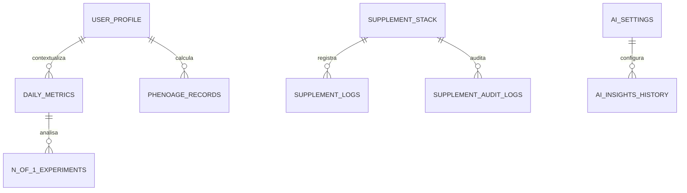

# Modelo de dados, segurança e privacidade

## Banco operacional

O banco é SQLite em `data/longevity.sqlite3`. O esquema é inicializado por `initialize_db` em `src/longevidade/db/schema.py` toda vez que o backend é importado/iniciado.

## Tabelas

| Tabela | Chave | Conteúdo e uso |
|---|---|---|
| `user_profile` | `id=1` | Perfil único: nome, email, nascimento, altura, peso/meta, sexo e avatar. |
| `daily_metrics` | `date_ref` | Passos, sono/fases, FC, HRV, peso, IMC, cintura, PA, força, VO2, estresse e fonte. |
| `lab_results` | `id` | Resultado por biomarcador/data, unidade, faixas, meta, categoria e notas. |
| `phenoage_records` | `id` | Resultado e os nove parâmetros utilizados na estimativa PhenoAge. |
| `kdm_records` | `id` | Estrutura para registros KDM; não há endpoint atual que grave nela. |
| `manual_entries` | `id` | Prevista no esquema, sem repositório/router atual. |
| `cgm_readings` | `id` | Prevista para leituras granulares; a implementação atual persiste somente resumo diário. |
| `cgm_daily_summary` | `date_ref` | Média, DP, CV, tempos por faixa e total de leituras de CGM. |
| `interventions` | `id` | Prevista no esquema, sem repositório/router atual. |
| `n_of_1_experiments` | `id` | Definição e estatísticas de experimentos pessoais. |
| `protocol_compliance` | `date_ref` | Quatro pilares booleanos, score e notas. |
| `supplement_stack` | `id` | Compostos ativos, dose, categoria, horário, frequência, início e notas. |
| `supplement_logs` | `id` | Registro diário de tomada, relacionado ao composto. |
| `supplement_audit_logs` | `id` | Inclusão, alteração de dose/horário e remoção de compostos. |
| `pipeline_run` | `id` | Status e logs das importações Zepp/Google. |
| `ai_settings` | `id=1` | Provedor, modelo, modo de privacidade, flags de presença e prompt customizado; chaves ficam no cofre do SO. |
| `ai_insights_history` | `id` | Histórico de análises/chat, provedor, modo de privacidade e prompt resumido. |

## Inicialização e migração

Além de `CREATE TABLE IF NOT EXISTS`, a inicialização:

1. tenta adicionar `category` à tabela `supplement_stack` para bancos legados;
2. garante uma linha em `user_profile` e uma configuração inicial em `ai_settings`;
3. insere cinco suplementos Blueprint de exemplo **somente quando a pilha está vazia**.

Essa inicialização é um efeito de escrita. Por isso, processos de teste e inspeção devem usar um banco temporário/isolado, nunca o banco de saúde operacional.

## Origem e retenção dos dados

| Dado | Origem atual | Persistência |
|---|---|---|
| Wearables | Projeto irmão Zepp (`../zepp`) | `daily_metrics` |
| Passos, PA e FC | Arquivos JSON do projeto irmão Google Health | `daily_metrics` |
| Exames | Formulário de lote/API | `lab_results` e `phenoage_records` |
| CGM | Corpo JSON ou CSV importado | `cgm_daily_summary` |
| Suplementos/hormônios | Interface/API | pilha, logs e auditoria |
| Avaliações Físicas | Upload/Formulário local | `physical_assessments`, `physical_assessment_photos` e `data/physical_assessments/` |
| IA | Chaves digitadas e respostas do provedor | `ai_settings` e `ai_insights_history` |

O `.gitignore` exclui `*.sqlite3`, `*.db`, `data/longevity.sqlite3` e `data/physical_assessments/`; estes arquivos não devem ser enviados ao repositório.

## Segurança e privacidade: estado atual

### Proteções existentes

- Servidor padrão ligado a `127.0.0.1` pelo `run_app.bat`.
- Chaves ficam fora do SQLite operacional quando o backend usa o cofre do SO; a API apenas retorna indicadores de presença e máscaras.
- O frontend usa campos `type="password"` ao editar chaves.
- O `.bat` e o backend mantêm o serviço em loopback; o CORS local é explícito para `http://127.0.0.1:8886` e `http://127.0.0.1:8887`.
- O contexto enviado ao LLM pelo `context_builder.py` inclui os resultados dos algoritmos determinísticos e guardrails (Daily Guidance e Energy Bank) para orientar o modelo quanto às limitações fisiológicas e integridade dos dados do dia.

### Limitações verificadas

1. **Chaves de IA dependem do cofre do SO.** O suporte atual evita texto simples no SQLite, mas ainda depende da disponibilidade do backend `keyring`/Credential Manager no ambiente local.
2. **Envio de contexto clínico a terceiros.** Chat e análises podem incluir dados clínicos no provedor selecionado. O modo `minimal` reduz a superfície, mas continua sendo compartilhamento de dados sensíveis com terceiro.
3. **Sem autenticação/autorização HTTP.** Qualquer processo que alcance o servidor local pode chamar as rotas.
4. **Erros externos silenciados em importadores.** Falhas em parsers/coletas são muitas vezes capturadas e convertidas em contagem zero/log, reduzindo visibilidade operacional.

## Recomendações para evolução segura

Antes de expor a aplicação além de `127.0.0.1` ou confiar nela com dados clínicos de terceiros:

1. Migrar as chaves para um cofre do SO (por exemplo, Windows Credential Manager) ou criptografar com chave fora do banco.
2. Exigir autenticação e restringir CORS a origens explícitas.
3. Separar/excluir identificadores pessoais do contexto enviado a LLMs; obter consentimento por provedor.
4. Registrar falhas de importação com mensagens visíveis para a UI e monitoramento.
5. Criar backup criptografado do SQLite e um procedimento de restauração testado.
6. Usar fixtures sintéticas e banco temporário para todos os testes HTTP/E2E.

## Escopo médico

Os cálculos e metas do aplicativo são auxiliares de organização e análise. Eles não são diagnóstico, prescrição ou substituição de consulta com profissional habilitado. Qualquer alteração de medicação/hormônio/suplementação deve ser discutida com acompanhamento clínico adequado.
