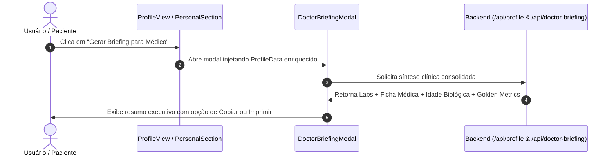

# Fase 4: Ações Clínicas, Integração de Briefing Médico, Exportação de Ficha & Garantia de Qualidade

---

## 1. Visão Geral e Objetivos

Esta fase final integra o novo Perfil de Longevidade ao fluxo de valor clínico do **Longevidade Hub**, conectando os dados enriquecidos ao gerador de relatórios médicos (`DoctorBriefingModal.tsx`), viabilizando a exportação/impressão da Ficha de Longevidade e executando uma suíte abrangente de validação e garantia de qualidade.

### Objetivos Principais
1. **Integração com o Briefing Médico**: Conectar a ação primária do perfil ao componente [DoctorBriefingModal.tsx](file:///e:/hermes/longevidade/frontend/src/components/DoctorBriefingModal.tsx), enriquecendo o relatório médico gerado com a Ficha Médica (Tipo Sanguíneo, Alergias, Histórico Familiar), Idade Biológica e Biomarcadores de Ouro.
2. **Exportação & Impressão da Ficha de Longevidade (*Clinical Passport*)**: Criar suporte para impressão/salvamento em PDF formatado e legível para consultas presenciais (`@media print`).
3. **Auditoria de Qualidade e Testes de Não-Regressão**: Executar a suíte de testes de backend (Pytest com fixture `client` obrigatório) e frontend (Vitest), assegurando zero quebras de contratos e zero regressões no Design System.
4. **Homologação Médica e de Dados (Princípio P0.5)**: Validar ausência de defaults clínicos falsos e aderência às diretrizes de privacidade local-first.

---

## 2. Integração com o `DoctorBriefingModal`

O Longevidade Hub já possui um modal avançado de preparação para consultas médicas ([DoctorBriefingModal.tsx](file:///e:/hermes/longevidade/frontend/src/components/DoctorBriefingModal.tsx)). Na Fase 4, a tela de Perfil passa a ser o ponto de partida ideal para essa funcionalidade:



### Novos Dados Injetados no Relatório Clínico
* **Identificação Médica**: Tipo Sanguíneo/Rh, Alergias medicamentosas (em destaque vermelho), Histórico familiar cardiovascular/oncológico.
* **Reserva Fisiológica**: VO2 Max estimado e percentil etário, HRV basal, FC Repouso e WHtR (Relação Cintura-Estatura).
* **Idade Biológica**: PhenoAge mais recente e delta biológico em relação à idade cronológica.
* **Farmacoterapia & Suplementação**: Lista dos compostos ativos do `supplement_stack`.

---

## 3. Exportação e Impressão da Ficha de Longevidade (*Passaporte Clínico*)

O Perfil contará com um estilo de impressão dedicado (`@media print`) permitindo gerar um PDF limpo de 1 ou 2 páginas para levar a consultas médicas:

```css
@media print {
  /* Oculta navegação, cabeçalho de abas, botões de ação e rodapés */
  nav, header, [role="tablist"], button, footer {
    display: none !important;
  }
  
  /* Remove sombras e ajusta contraste para papel branco */
  .shadow-xs, .shadow-md, .shadow-lg {
    box-shadow: none !important;
  }
  
  /* Garante tipografia legível em tons neutros de alta fidelidade */
  body, #panel-profile-personal {
    background: #ffffff !important;
    color: #0f172a !important;
  }
}
```

O cabeçalho do documento impresso incluirá:
* Título formal: *"Longevidade Hub — Ficha Fisiológica e Resumo Clínico do Paciente"*
* Timestamp da impressão e versão do aplicativo.
* Aviso de privacidade: *"Dados coletados localmente pelo próprio paciente sob supervisão de saúde."*

---

## 4. Pipeline de Testes e Validação Completa

### 4.1 Testes de Backend (Pytest)
Conforme a regra arquitetural estrita do projeto:
> **Regra Obrigatória:** Em qualquer teste em `tests/`, SEMPRE injetar o fixture `client: TestClient` como parâmetro das funções de teste HTTP. NUNCA instanciar `TestClient(app)` globalmente no nível de módulo.

Arquivo: `tests/test_profile_clinical_integration.py`
```python
from starlette.testclient import TestClient

def test_full_profile_enrichment_flow(client: TestClient):
    """Valida o fluxo completo de leitura, atualização e agregação do perfil."""
    # 1. Leitura inicial
    res_get = client.get("/api/profile")
    assert res_get.status_code == 200
    initial_data = res_get.json()
    assert "medical_id" in initial_data
    assert "lifestyle" in initial_data
    assert "golden_metrics" in initial_data

    # 2. Atualização de dados médicos e hábitos
    payload = {
        "blood_type": "O+",
        "allergies": "Dipirona",
        "emergency_contact_name": "Juliana",
        "emergency_contact_phone": "+5511999998888",
        "fasting_window": "16:8",
        "chronotype": "Matutino",
        "daily_water_target_ml": 3000,
    }
    res_post = client.post("/api/profile", json=payload)
    assert res_post.status_code == 200

    # 3. Verificação de persistência
    res_verify = client.get("/api/profile")
    updated = res_verify.json()
    assert updated["medical_id"]["blood_type"] == "O+"
    assert updated["medical_id"]["allergies"] == "Dipirona"
    assert updated["lifestyle"]["fasting_window"] == "16:8"
```

### 4.2 Testes de Frontend (Vitest & React Testing Library)
Comandos de execução:
```bash
npm run test:run
```
Cenários validados:
* Abertura do modal de briefing de médico a partir do botão no perfil.
* Renderização completa de `ProfileView` alternando entre as 3 abas (*Meu Perfil*, *Integrações*, *Diagnóstico e Sistema*) sem quebras.
* Acessibilidade via teclado (`Tab`, `Enter`, `Escape`) no modal de edição.

---

## 5. Auditoria de Conformance de Design System

O projeto mantém ferramentas automatizadas para garantir conformidade de interface com o `DESIGN_SYSTEM.md`:

```bash
# Executa a auditoria de tokens e conformidade de design
npm run test -- --grep "Design System"
```

### Itens Auditados
* [x] **Zero Classes de Cores Não Autorizadas**: Uso exclusivo da paleta Tailwind autorizada (`slate`, `emerald`, `cyan`, `amber`, `rose`, `violet`).
* [x] **Zero Estilos Inline de Cores Arbitrárias**: Estilos hardcoded como `style={{ color: '#123456' }}` são terminantemente proibidos.
* [x] **Conformidade de Raio de Borda**: Uso de tokens `rounded-radius-xl` e `rounded-radius-lg`.
* [x] **Compatibilidade Total Dark/Light**: Toda cor possui sua contraparte `dark:` correspondente garantindo contraste mínimo de 4.5:1.

---

## 6. Homologação Médica e Integridade de Dados (P0.5)

| Requisito Clínico | Critério de Aceite |
| :--- | :--- |
| **Não-Ficção de Biomarcadores** | Se não há exame cadastrado, PhenoAge é estritamente `null`. |
| **Limites Fisiológicos Válidos** | O sistema rejeita pesos $< 20$ kg ou alturas $< 50$ cm com erro 422 claro. |
| **Alergias em Destaque Visual** | Alergias medicamentosas registradas devem ser exibidas com ícone de alerta para fácil visualização pelo profissional de saúde. |
| **Aviso Médico Permanente** | Exibição do disclaimer clínico: *"Este aplicativo organiza dados coletados pelo próprio usuário e não substitui consulta médica."* |

---

## 7. Critérios de Aceitação e Definição de Pronto Final (DoD da Release)

- [ ] Todas as 4 fases implementadas e documentadas em conformidade mútua.
- [ ] Backend 100% testado com Pytest respeitando o isolamento de ambiente.
- [ ] Frontend 100% testado com Vitest sem avisos no console.
- [ ] Auditoria de Design System aprovada sem violações de tokens.
- [ ] Botão de Briefing Médico e Exportação de Ficha funcionando em produção.
- [ ] Documentação de arquitetura do Longevidade Hub atualizada em `docs/overview.md`.
