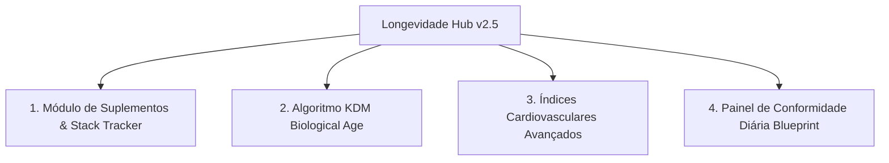

# Análise Médica E2E e Pesquisa de Mercado — Longevidade Hub

**Data**: 29/07/2026  
**Fontes de Pesquisa**: Comúnidades `r/blueprint_`, `r/Biohackers` e `r/longevity` no Reddit  
**Objetivo**: Avaliar o alinhamento do **Longevidade Hub** com o estado da arte em medicina de precisão, biohacking e protocolos anti-envelhecimento.

---

## 1. Auditoria E2E do Estado Atual do Sistema Longevidade

| Módulo do Sistema | Funcionalidades Atuais | Nível de Cobertura Médica |
| :--- | :--- | :--- |
| **Epigenética & Idade Biológica** | Fórmula Morgan Levine PhenoAge (9 biomarcadores) e Delta de Rejuvenescimento | ⭐⭐⭐⭐ (Excelente) |
| **Recuperação & Autonômico** | HRV (rMSSD), Frequência Cardíaca de Repouso (RHR), Sono (Fases), Passos, PA e VO2 Max | ⭐⭐⭐⭐⭐ (Completo) |
| **Metabolismo & CGM** | Sensor de Glicemia Contínua (Glicemia Média 24h, Time-in-Range 70-140, CV% de variabilidade) | ⭐⭐⭐⭐⭐ (Completo) |
| **Exames de Sangue** | Catálogo com 35+ biomarcadores categorizados nas 8 áreas médicas vitais | ⭐⭐⭐⭐ (Excelente) |
| **Metodologia Científica** | Testes N-of-1 controlados (Cálculo de d de Cohen, valor p e significância estatística) | ⭐⭐⭐⭐⭐ (Diferencial Único) |
| **Copiloto de IA** | Análise integrativa multi-provedor (OpenAI, Anthropic, OpenRouter com DeepSeek v4 Pro) com contexto diário de 14 dias | ⭐⭐⭐⭐⭐ (Estado da Arte) |

---

## 2. Principais Tendências Identificadas nas Comunidades Reddit

### 🔹 r/blueprint_ (Protocolo Bryan Johnson)
1. **Foco em Sistema de Controle, Não Apenas Dieta**: A comunidade enfatiza que o Blueprint é um *sistema de medição e controle*, onde dados biológicos direcionam o protocolo.
2. **Biomarcadores Críticos Mais Citados**: ApoB (cardiovascular), PCR-us (inflamação sistêmica), Glicose/HbA1c (sensibilidade à insulina), Relação Triglicerídeos/HDL, Creatinina/Cistatina C (função renal) e ALT/AST/GGT (saúde hepática).
3. **Plano Diário de Conformidade (Daily Compliance Index)**: Acompanhamento de 0 a 100% no cumprimento de pilares (Janela de sono rigorosa, suplementação, dieta e exercício).

### 🔹 r/Biohackers (Medicina Preventiva & Intervenções)
1. **Rastreamento de Suplementação & Doses (Supplement Stack Manager)**: Dificuldade recorrente com aplicativos existentes que não correlacionam a introdução de um suplemento (ex: NMN, Berberina, Ômega-3) com a mudança posterior nos exames de sangue ou HRV.
2. **Calculadoras Biológicas Adicionais**: Além da fórmula PhenoAge, uso frequente do algoritmo **KDM (Klemera-Doubal Method)** para ter validação dupla de idade biológica.
3. **Razões e Índices Cardiovasculares Derivados**: Cálculo automático da Razão ApoB/ApoA1, Razão Triglicerídeos/HDL e Colesterol Remanescente.

---

## 3. Matriz de Lacunas e Novas Funcionalidades Propostas

Para tornar o **Longevidade Hub** a plataforma número 1 em inteligência de longevidade, recomendamos a implementação dos seguintes 4 novos módulos:

### 🎯 1. Gerenciador de Pilha de Suplementação (Supplement Stack Tracker)
- **O que faz**: Permite cadastrar a rotina de suplementos diários (ex: NMN 500mg, Ômega-3 2g, Berberina 500mg, Creatina 5g), marcar a tomada diária com 1 clique e visualizar a data de início da intervenção sobreposta nos gráficos de HRV e Glicemia.

### 🎯 2. Algoritmo KDM (Klemera-Doubal Method Biological Age)
- **O que faz**: Adiciona um segundo modelo matemático consagrado de idade biológica que roda em paralelo ao PhenoAge de Morgan Levine, permitindo uma estimativa ainda mais robusta da taxa de envelhecimento.

### 🎯 3. Calculadora de Índices Cardiovasculares Avançados
- **O que faz**: Calcula automaticamente a **Razão ApoB / ApoA1**, **Razão Triglicerídeos / HDL** e **Colesterol Remanescente** (`Total - HDL - LDL`) a partir dos exames de sangue inseridos, com alertas de risco arterial segundo as diretrizes de Peter Attia e Blueprint.

### 🎯 4. Widget de Conformidade Diária (Daily Blueprint Score)
- **O que faz**: Card interativo na Visão Geral para registrar em 5 segundos se a janela de sono foi cumprida, se os suplementos foram tomados e se a meta de treino foi atingida, gerando uma pontuação de 0% a 100%.
