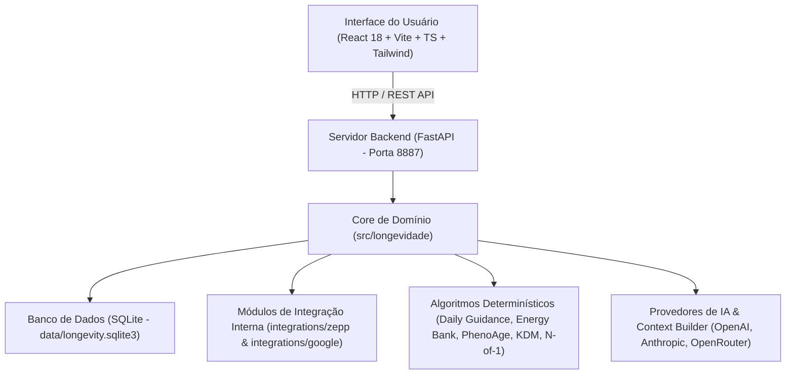

# Longevidade Hub — Documento de Visão Geral (Overview)

> [!NOTE]
> Este documento foi elaborado para servir como guia central e ponto de entrada para **desenvolvedores, pesquisadores e agentes de Inteligência Artificial (IA)**. Ele descreve o propósito, a arquitetura, as funcionalidades, a modelagem de dados e as diretrizes de execução do **Longevidade Hub**.

---

## 1. Visão Geral e Propósito do Projeto

O **Longevidade Hub** é uma plataforma local, privada e autônoma de **inteligência de dados de saúde e longevidade de precisão**. O sistema é projetado para consolidar, analisar e calcular métricas de biomarcadores inspiradas nos mais modernos protocolos de medicina preventiva e longevidade (como o protocolo *Blueprint* / Bryan Johnson, *PhenoAge* de Morgan Levine, e a Idade Biológica de *Klemera-Doubal / KDM*).

### Objetivos Principais:
1. **Centralização de Dados Clínicos e Wearables**: Agregação de dados diários de wearables (**Zepp/Amazfit** e **Google Fit / Health Connect**), exames laboratoriais de sangue, sensores de glicemia contínua (CGM), e registros de suplementos/hormônios.
2. **Cálculo de Biomarcadores de Idade Biológica**: Algoritmos matemáticos determinísticos em Python para cálculo do **PhenoAge** (9 biomarcadores laboratoriais) e **KDM Biological Age**.
3. **Validação Científica de Intervenções (N-of-1)**: Motor estatístico para testes *N-of-1* pessoais utilizando estatística inferencial (teste *t* de Welch, *Cohen's d* para tamanho do efeito e valor-*p*).
4. **Assistente Clínico Inteligente (Copiloto de IA)**: Integração com provedores de modelos de linguagem (OpenAI, Anthropic, OpenRouter) com privacidade configurável para análise de dados e geração de resumos médicos (*Doctor Briefing*).
5. **Autonomia Local e Privacidade**: Execução 100% local no computador do usuário, com banco de dados SQLite local (`longevity.sqlite3`) e conectores integrados sem dependências de pastas externas no sistema operacional.

---

## 2. Arquitetura do Sistema

O projeto adota uma arquitetura em camadas clara, desacoplada e autônoma:



### Componentes Principais da Estrutura:

| Diretório / Arquivo | Descrição |
|---|---|
| [frontend/](file:///e:/hermes/longevidade/frontend) | Aplicação web SPA em React 18, TypeScript, Tailwind CSS, Lucide Icons e Recharts. |
| [backend/app/](file:///e:/hermes/longevidade/backend/app) | Servidor web FastAPI (rotas REST `/api/*`, gerenciamento de sessão, inicializador de banco). |
| [src/longevidade/](file:///e:/hermes/longevidade/src/longevidade) | Módulo principal do Python contendo banco de dados, repositório SQLite, regras de negócio, parsers e calculadores. |
| [integrations/](file:///e:/hermes/longevidade/integrations) | **Conectores e arquivos internos autônomos** para o Zepp (Amazfit) e Google Fit (snapshots JSON, scripts e CLI). |
| [docs/](file:///e:/hermes/longevidade/docs) | Documentação técnica, arquitetura, referências da API REST, segurança e roteiros de evolução. |
| [data/](file:///e:/hermes/longevidade/data) | Armazenamento do banco de dados operacional SQLite (`longevity.sqlite3`). |

---

## 3. Módulos e Funcionalidades do Sistema

### 📊 Visão Geral (Dashboard)
- Exibição de cartões de métricas principais do dia selecionado: **Passos 24h**, **RHR (Frequência Cardíaca em Repouso)**, **HRV Noturna (Variabilidade de FC)**, **Sono Total**, **VO2 Máximo** e **Pressão Arterial**.
- Filtro por seletor de data e navegadores de intervalo (7 dias, 30 dias, 90 dias).
- Gráficos visuais de variabilidade cardíaca e fases do sono.

### 🧪 Exames & PhenoAge / KDM
- **Entrada em Lote de Exames**: Formulário para inserção rápida de exames de sangue com normalização de unidades.
- **PhenoAge (Morgan Levine)**: Cálculo da idade biológica fenomenológica com base em 9 marcadores (Albumin, Creatinine, Glucose, hs-CRP, Lymphocyte %, MCV, RDW, Alkaline Phosphatase, WBC).
- **KDM Biological Age**: Método Klemera-Doubal para cálculo da taxa de envelhecimento biológico acumulado.

### 📈 Sensor Contínuo de Glicose (CGM)
- Importação de arquivos CSV de sensores contínuos (formato vírgula ou ponto e vírgula).
- Cálculo automático de médias diárias, variabilidade da glicemia e tempo na faixa (*Time in Range*).
- Exportação de resumos em CSV.

### 🔬 Experimentos Pessoais (N-of-1 Tests)
- Registro de testes A/B pessoais (ex: Testar suplemento X vs período Controle Y).
- Comparação estatística entre fases de baseline e intervenção com cálculo de teste *t* de Welch, efeito *Cohen's d* e significância estatística (*p-value*).

### 💊 Suplementos & Hormônios (Protocol Stack)
- Gerenciamento de protocolo diário de suplementação e terapias hormonais.
- Registro de tomadas diárias com pontuação de conformidade.
- Trilha de auditoria para histórico de edições e remoções no protocolo.

### 📷 Avaliações Físicas & Registro Fotográfico
- Cadastro periódico de avaliações corporais vinculadas a datas, peso, % de gordura e circunferências.
- Registro e armazenamento local de fotografias classificadas por ângulo (Frente, Costas, Lado Esquerdo, Lado Direito, Outro).
- Sanitização de EXIF por privacidade e geração de hash SHA-256 por imagem.
- Comparador visual de períodos lado a lado com cálculo de deltas numéricos e pareamento de fotos equivalentes.

### 🤖 Copiloto de IA & Relatórios Médicos
- **Configuração de IA**: Conexão segura com OpenAI, Anthropic ou OpenRouter (com armazenamento no Windows Credential Vault quando disponível).
- **Chat Copiloto**: Interface conversacional para dúvidas sobre métricas, exames e interações da pilha de suplementação.
- **Doctor Briefing**: Gerador de relatórios em Markdown estruturados para apresentação em consultas médicas.

### 👤 Perfil & Histórico de Sincronizações
- Perfil do usuário (idade cronológica, nascimento, altura, peso atual, meta de peso e IMC).
- **Histórico de Sincronizações (Pipelines)**: Visualizador de histórico de chamadas de ingestão dos dados dos conectores Zepp e Google Fit localizado na parte inferior do Perfil.

---

## 4. Como Executar e Validar

### 🚀 Execução em Produção / Local Integrado
Na raiz do repositório no Windows, execute:
```cmd
run_app.bat
```
O script cuidará da inicialização do ambiente Python (`.venv`), instalação de dependências, compilação do frontend caso necessário e inicialização do servidor FastAPI no endereço:
👉 **URL:** `http://127.0.0.1:8887`

### 🧪 Execução de Testes Automatizados

#### Backend (Python / Pytest):
```bash
python -m pytest
```
*Garante o funcionamento de todos os calculadores (PhenoAge, KDM, CGM), repositório SQLite e importadores de dados.*

#### Frontend (React / Vitest):
```bash
cd frontend
npm run test -- --run
```
*Testa componentes visuais, trocas de abas, modais e chamadas de API.*

#### Build de Produção do Frontend:
```bash
cd frontend
npm run build
```

---

## 5. Diretrizes para Agentes de IA (Instruções do Sistema)

Ao modificar ou evoluir o código deste repositório, qualquer assistente de IA deve seguir as regras estritas abaixo:

> [!CAUTION]
> 1. **Isolamento de Arquivos 100% Interno**: **Nunca** importar, ler ou depender de caminhos fora da pasta `e:\hermes\longevidade`. Todas as integrações (Zepp e Google Fit) devem ser resolvidas via `integrations/`.
> 2. **Integridade de Esquema do SQLite**: Não alterar assinaturas de métodos do `LongevityRepository` sem atualizar todas as chamadas correspondentes em `backend/app/routers/` e nos testes em `tests/`.
> 3. **Sem Correções Superficiais**: Quando um teste falhar, investigue a causa raiz lendo o log completo. Não comente testes nem suprima exceções com blocos genéricos `except: pass`.
> 4. **Verificação Obrigatória**: Sempre valide alterações executando a suíte de testes (`python -m pytest` e `npm run test -- --run`) antes de declarar uma tarefa concluída.

---

## 6. Mapa de Documentação Adicional

Para aprofundamento específico em cada área do projeto, consulte a documentação detalhada na pasta `docs/`:

- [docs/architecture.md](file:///e:/hermes/longevidade/docs/architecture.md): Detalhamento técnico da arquitetura e fluxo de dados.
- [docs/api-reference.md](file:///e:/hermes/longevidade/docs/api-reference.md): Documentação dos endpoints REST da API FastAPI.
- [docs/data-model-and-security.md](file:///e:/hermes/longevidade/docs/data-model-and-security.md): Modelo de dados do SQLite e diretrizes de privacidade/segurança.
- [docs/development-and-validation.md](file:///e:/hermes/longevidade/docs/development-and-validation.md): Guia completo de testes e ambiente de desenvolvimento.
- [docs/sdd.md](file:///e:/hermes/longevidade/docs/sdd.md): Software Design Document com as especificações do sistema.
