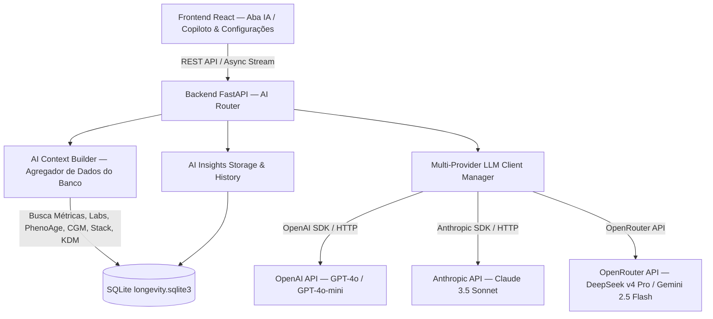

# System Design & Development (SDD) — Módulo de Inteligência Artificial para o Longevidade Hub

**Versão**: 2.1.0  
**Data**: 29/07/2026  
**Status**: Aprovado para Desenvolvimento  
**Localização**: `E:\antigravity\projetos\longevidade\docs\sdd.md`

---

## 1. Visão Geral e Objetivos do Módulo de IA

O **Módulo de Inteligência Artificial do Longevidade Hub** visa atuar como um **Copiloto de Longevidade e Medicina de Precisão (AI Longevity Copilot)** baseado nos princípios do *Protocolo Blueprint (Bryan Johnson)* e Medicina Funcional/Epigenética.

### Objetivos Principais:
1. **Análise de Dados de Saúde**: Sintetizar biomarcadores de exames de sangue, idade biológica (PhenoAge), curva de glicemia contínua (CGM), variabilidade de frequência cardíaca (HRV), qualidade de sono e pressão arterial em *insights* acionáveis.
2. **Multi-Provider LLM Agnostic**: Permitir ao usuário alternar dinamicamente entre **OpenAI**, **Anthropic** e **OpenRouter** através do fornecimento seguro de suas próprias chaves de API (`API Keys`).
3. **Privacidade e Controle Local**: Os dados de saúde são sintetizados e anonimizados localmente antes de serem enviados à API selecionada. As chaves de API são armazenadas exclusivamente no banco de dados local SQLite (`longevity.sqlite3`) com criptografia em repouso.
4. **Prompting Especializado & Guia de Protocolos**: Prompts estruturados com contexto clínico avançado (Morgan Levine PhenoAge, alvos de longevidade Blueprint, segurança renal/hepática, testes N-of-1).

---

## 2. Arquitetura de Componentes do Módulo de IA



---

## 3. Especificação do Gerenciador de Provedores (Multi-Provider Engine)

O sistema suportará 3 provedores principais por meio de uma interface abstrata em Python `BaseAIProvider`:

| Provedor | Modelos Suportados | Tipo de Autenticação | Base URL |
| :--- | :--- | :--- | :--- |
| **OpenAI** | `gpt-4o`, `gpt-4o-mini`, `o3-mini` | `Bearer <OPENAI_API_KEY>` | `https://api.openai.com/v1` |
| **Anthropic** | `claude-3-5-sonnet-20241022`, `claude-3-5-haiku-20241022` | `x-api-key: <ANTHROPIC_API_KEY>` | `https://api.anthropic.com/v1` |
| **OpenRouter** | `deepseek/deepseek-v4-pro`, `google/gemini-2.5-flash`, `deepseek/deepseek-r1`, `anthropic/claude-3.5-sonnet`, `openai/gpt-4o` | `Bearer <OPENROUTER_API_KEY>` | `https://openrouter.ai/api/v1` |

### Armazenamento de Chaves de API (Segurança)
- Tabela SQLite: `ai_settings`
  - `id`: INTEGER PRIMARY KEY (1)
  - `active_provider`: TEXT (`openai`, `anthropic`, `openrouter`)
  - `selected_model`: TEXT (ex: `deepseek/deepseek-v4-pro`)
  - `openai_api_key`: TEXT (criptografado / obfuscated)
  - `anthropic_api_key`: TEXT (criptografado / obfuscated)
  - `openrouter_api_key`: TEXT (criptografado / obfuscated)
  - `system_prompt_custom`: TEXT (opcional para personalizações)
  - `updated_at`: TIMESTAMP

---

## 4. Construtor de Contexto Clínico (AI Context Builder)

O **AI Context Builder** é a peça central responsável por varrer o banco de dados SQLite e construir um prompt enriquecido com os dados do usuário dos últimos 30 dias + detalhamento diário de 14 dias:

1. **Perfil do Paciente**: Nome, Idade Cronológica, Altura, Peso Atual, IMC, Meta de Peso.
2. **PhenoAge & KDM Epigenética**: Idade biológica Morgan Levine PhenoAge + Idade biológica KDM (Klemera-Doubal) + Deltas de Rejuvenescimento.
3. **Métricas Diárias de Wearables**:
   - HRV Noturna Média e tendência (ms)
   - Frequência Cardíaca de Repouso (RHR bpm)
   - Passos médios por dia
   - Horas e fases de sono (Profundo, REM, Leve)
   - Pressão Arterial média (Sistólica / Diastólica)
4. **Exames Laboratoriais & Razões Cardiovasculares**: Alvos de longevidade + Razão ApoB/ApoA1 + Razão TG/HDL + Colesterol Remanescente.
5. **Pilha de Suplementação Ativa**: Lista de suplementos diários, dosagens e data de início.
6. **Conformidade Diária Blueprint**: Score médio de 0 a 100% no cumprimento de protocolo.
7. **Glicemia Contínua (CGM)**: Glicemia Média 24h, Time-in-Range (%), Variabilidade (CV %).
8. **Experimentos N-of-1**: Intervenções ativas e resultados estatísticos.

---

## 5. Casos de Uso e Recursos de IA no Frontend

1. **Aba "IA & Copiloto" no Header**:
   - **Dashboard de Insights**: Cartões com recomendações de rotina, sono, nutrição e suplementação priorizados por urgência e impacto de longevidade.
   - **Chat Interativo com o Copiloto**: Fazer perguntas sobre seus próprios dados ("A berberina está ajudando na minha glicemia?", "O que minha HRV indica?").
   - **Gerador de Relatório de Consulta Médica (AI Clinical Briefing)**: Criação de relatório sumarizado de alto nível em linguagem médica para levar à consulta.
2. **Modal de Configuração de Provedores e Chaves de API**:
   - Seleção do Provedor Ativo (OpenAI / Anthropic / OpenRouter).
   - Campo para colar a API Key com teste de conexão instantâneo (`Testar Chave`).
   - Seletor de modelos com base no provedor ativo.

---

## 6. Diretrizes de Segurança, Privacidade e Limites Médicos

> [!IMPORTANT]
> **Isenção de Responsabilidade Médica (Medical Disclaimer)**:
> O sistema opera como uma ferramenta de apoio à decisão pessoal e inteligência de dados baseada em literatura científica pública e no protocolo Blueprint. Toda sugestão de IA contém o aviso explícito de que não substitui a consulta médica com profissional registrado.

---

## 7. Esquema do Banco de Dados para IA

```sql
CREATE TABLE IF NOT EXISTS ai_settings (
    id INTEGER PRIMARY KEY DEFAULT 1,
    active_provider TEXT DEFAULT 'openrouter',
    selected_model TEXT DEFAULT 'deepseek/deepseek-v4-pro',
    openai_api_key TEXT,
    anthropic_api_key TEXT,
    openrouter_api_key TEXT,
    system_prompt_custom TEXT,
    updated_at TIMESTAMP DEFAULT CURRENT_TIMESTAMP
);

CREATE TABLE IF NOT EXISTS ai_insights_history (
    id INTEGER PRIMARY KEY AUTOINCREMENT,
    created_at TIMESTAMP DEFAULT CURRENT_TIMESTAMP,
    provider_used TEXT NOT NULL,
    model_used TEXT NOT NULL,
    category TEXT NOT NULL, -- 'geral', 'laboratorios', 'sono_hrv', 'glicemia', 'n_of_1'
    headline TEXT NOT NULL,
    insight_text TEXT NOT NULL,
    actionable_steps TEXT,
    user_prompt TEXT,
    tokens_used INTEGER
);
```

---

## 8. Critérios de Aceitação e Validação
- **Troca de Provedores sem Reiniciar**: Mudar da OpenAI para Anthropic ou OpenRouter pela interface e obter respostas sem erro.
- **Respostas Baseadas nos Dados Reais**: A IA faz referência precisa aos números do usuário (ex: "Sua HRV de 65ms e seu ApoB de 58 mg/dL...").
- **Histórico Persistido**: As análises e conversas anteriores ficam salvas no SQLite para consulta.
- **Suíte de Testes com Mocks**: Testes automatizados executam usando mock de chamadas de API para não consumir tokens reais durante o build.

---

## 9. Diretrizes de Versionamento e Commits de Segurança (Git Workflow)

> [!IMPORTANT]
> **Regra Obrigatória de Versionamento**:
> Todas as tarefas e subtarefas concluídas durante o desenvolvimento DEVEM ser comitadas no Git imediatamente após a validação do código. Isso garante rastreabilidade total e permite reverter alterações com segurança caso ocorra qualquer problema.
> - Padrão de mensagem: `feat(ai): <descrição concisa da tarefa/subtarefa>`
> - Verificação pós-commit: Confirmar árvore limpa via `git status`.

---

## 10. Alinhamento Arquitetural das Novas Adições (Fase 3) com a IA Embutida

As 4 novas adições médicas (Supplement Stack, Algoritmo KDM, Índices Cardiovasculares e Score Blueprint) estão **100% alinhadas e integradas nativamente à inteligência artificial**:

| Novo Recurso (Fase 3) | Integração com o AI Context Builder | Impacto nas Respostas da IA |
| :--- | :--- | :--- |
| **1. Supplement Stack Tracker** | Injeta a lista completa de suplementos ativos, dosagens e datas de início sob o bloco `=== PILHA DE SUPLEMENTAÇÃO ATIVA ===`. | A IA passa a correlacionar suplementos específicos com mudanças de exames e HRV (ex: *"Sua introdução de NMN em 15/06 coincide com uma elevação na HRV..."*). |
| **2. KDM Biological Age** | Passa a idade biológica do modelo KDM lado a lado com a Morgan Levine PhenoAge. | A IA realiza análises comparativas de dupla validação da taxa de envelhecimento biológico. |
| **3. Índices Cardiovasculares Avançados** | Fornece as razões calculadas `ApoB/ApoA1`, `Triglicerídeos/HDL` e `Colesterol Remanescente`. | A IA emite alertas vasculares mais precisos segundo o protocolo de aterosclerose de Peter Attia. |
| **4. Daily Blueprint Score** | Envia a pontuação de conformidade dos últimos 14 dias sob `=== CONFORMIDADE DO PROTOCOLO BLUEPRINT ===`. | A IA avalia a relação entre disciplina de rotina (ex: > 90% compliance) e melhoria de biomarcadores. |
